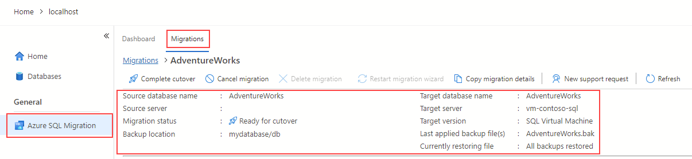

---
lab:
  title: Migrieren von SQL Server-Datenbanken zu SQL Server auf einem virtuellen Azure-Computer
---

# Migrieren von SQL Server-Datenbanken zu SQL Server auf einem virtuellen Azure-Computer

In dieser Übung erfahren Sie, wie Sie mithilfe der Azure-Migrationserweiterung für Azure Data Studio eine SQL Server-Datenbank auf einen SQL Server migrieren, der auf einem virtuellen Azure-Computer ausgeführt wird. Sie beginnen, indem Sie die Azure-Migrationserweiterung für Azure Data Studio installieren und starten. Anschließend führen Sie eine Online-Migration einer SQL Server-Datenbank auf einen SQL Server durch, der auf einem virtuellen Azure-Computer läuft. Außerdem erfahren Sie, wie Sie den Migrationsprozess auf dem Azure-Portal überwachen und den Übernahmeprozess abschließen, um die Migration abzuschließen.

Diese Übung dauert ungefähr **45** Minuten.

> **Hinweis**: Um diese Übung abzuschließen, benötigen Sie Zugriff auf ein Azure-Abonnement, um Azure-Ressourcen zu erstellen. Wenn Sie kein Azure-Abonnement besitzen, können Sie ein [kostenloses Konto](https://azure.microsoft.com/free/?azure-portal=true) erstellen, bevor Sie beginnen.

## Vorbereitung

Um diese Übung auszuführen, benötigen Sie Folgendes:

| Element | Beschreibung |
| --- | --- |
| **Zielserver** | Einen SQL Server auf einem virtuellen Azure-Computer. Weitere Informationen finden Sie unter [Bereitstellung eines SQL-Servers auf einem virtuellen Azure-Computer](https://microsoftlearning.github.io/dp-300-database-administrator/Instructions/Labs/01-provision-sql-vm.html). **Hinweis:** Die SQL Server-Version zwischen Ziel und Server muss identisch sein. |
| **Quellserver** | Die neueste [SQL Server-Version](https://www.microsoft.com/en-us/sql-server/sql-server-downloads), die auf einem Server Ihrer Wahl installiert ist. |
| **Quelldatenbank** | Die einfache [AdventureWorks](https://learn.microsoft.com/sql/samples/adventureworks-install-configure)-Datenbank, die auf der SQL Server 2022-Instanz wiederhergestellt werden soll. |

## Bereitstellung eines Azure-Speicherkontos mit einem Blobcontainer

Der Zweck der Erstellung eines Azure-Speicherkontos besteht darin, die vollständigen und Transaktionsprotokollsicherungen für die Migration zu speichern. Wir verwenden das Speicherkonto später in dieser Übung.

1. Melden Sie sich beim [Azure-Portal](https://portal.azure.com/) an.
1. Wählen Sie im Menü des linken Portals **Speicherkonten** aus, um eine Liste Ihrer Speicherkonten anzuzeigen. Wenn das Portalmenü nicht angezeigt wird, wählen Sie die Menüschaltfläche aus, um es einzublenden.
1. Wählen Sie auf der Seite **Speicherkonten** die Option **Erstellen** aus.
1. Wählen Sie unter **Projektdetails** das gleiche Azure-Abonnement aus, in dem Sie den virtuellen Computer von Azure erstellt haben.
1. Wählen Sie dieselbe Ressourcengruppe aus, in der Sie den virtuellen Azure-Computer erstellt haben. 
1. Wählen Sie einen eindeutigen Namen für Ihr Speicherkonto aus, und wählen Sie dieselbe Region wie die des virtuellen Azure-Computers aus.
1. Wählen Sie **Standard** als Dienstebene aus.
1. Belassen Sie alle übrigen Optionen auf ihren Standardwerten.
1. Klicken Sie auf**Überprüfen + erstellen** und dann auf **Erstellen**.

Nachdem das Speicherkonto erstellt wurde, können Sie einen Container erstellen, indem Sie die folgenden Schritte ausführen:

1. Navigieren Sie im Azure-Portal zu Ihrem neu erstellten Speicherkonto.
1. Blättern Sie im linken Menü des Speicherkontos zu **Blob-Dienst** und wählen Sie **Container**.
1. Wählen Sie **+ Container** aus, um einen neuen Container zu erstellen.
1. Geben Sie auf der neuen Containerseite die folgenden Informationen an:
    - **Name:***Name Ihrer Einstellung*
    - **Öffentliche Zugriffsebene:** Privat
1. Klicken Sie auf **Erstellen**.

## Installieren und Ausführen der Azure-Migrationserweiterung für Azure Data Studio

Bevor Sie die Azure-Migrationserweiterung verwenden können, müssen Sie [Azure Data Studio](https://learn.microsoft.com/sql/azure-data-studio/download-azure-data-studio) installieren. Installieren Sie für dieses Szenario Azure Data Studio auf demselben Server, auf dem sich die Quelldatenbank befindet. Die Erweiterung ist in Azure Data Studio Marketplace verfügbar.

Führen Sie die folgenden Schritte aus, um die Migrationserweiterung zu installieren:

1. Öffnen Sie den Erweiterungs-Manager in Azure Data Studio.
1. Suchen Sie nach ***Azure SQL Migration***, und wählen Sie die Erweiterung aus.
1. Installieren Sie die Erweiterung. Nach der Installation befindet sich die Azure SQL Migrationserweiterung in der Liste der installierten Erweiterungen.
1. Stellen Sie in Azure Data Studio eine Verbindung mit einer SQL Server-Instanz her.
1. Um die Azure-Migrationserweiterung zu starten, klicken Sie mit der rechten Maustaste auf den Namen der Quellinstanz und wählen Sie **Verwalten**, um auf das Dashboard und die Landing Page der Azure SQL Migrationserweiterung zuzugreifen.

## Durchführen einer Online-Migration einer SQL Server-Datenbank zu einem SQL Server, der auf einem virtuellen Azure-Computer läuft

Um eine Migration mit minimaler Ausfallzeit mit Azure Data Studio durchzuführen, führen Sie die folgenden Schritte aus:

1. Starten Sie den Assistenten zum Migrieren zu Azure SQL innerhalb der Erweiterung in Azure Data Studio.

1. Wählen Sie unter **Schritt 1: Datenbanken für die Bewertung** die Datenbank aus, die Sie migrieren möchten, und wählen Sie dann **Weiter**.
    
    > **Hinweis**: Es wird empfohlen, Leistungsdaten zu sammeln und die richtigen Azure-Empfehlungen zu erhalten.

1. Unter **Schritt 2: Bewertungsergebnisse und Empfehlungen** warten Sie, bis die Bewertung abgeschlossen ist, und wählen dann **SQL Server auf Azure Virtual Machine** als **Azure SQL**-Ziel.

1. Wählen Sie unten auf der Seite **Schritt 2: Bewertungsergebnisse und Empfehlungen** die Option **Anzeigen/Auswählen**, um die Bewertungsergebnisse anzuzeigen. Wählen Sie die zu migrierende Datenbank aus. 

    > **Hinweis**: Nehmen Sie sich einen Moment Zeit, um die Bewertungsergebnisse auf der rechten Seite zu überprüfen.

1. Wählen Sie in **Schritt 3: Azure SQL-Ziel** ein Azure-Konto und Ihr Ziel-SQL Server auf dem virtuellen Azure-Computer aus.

    

1. Unter **Schritt 4: Azure Database Migration Service** erstellen Sie einen neuen Azure Database Migration Service mit dem Azure Data Studio-Assistenten. Wenn Sie bereits einen solchen erstellt haben, können Sie ihn wiederverwenden. Alternativ können Sie eine Azure Database Migration Service-Ressource über das Azure-Portal erstellen.

    > **Hinweis**: Stellen Sie sicher, dass das Abonnement für die Verwendung des Namespace  **Microsoft.DataMigration** registriert ist. Wie Sie die Registrierung eines Ressourcenanbieters durchführen, erfahren Sie unter [Registrieren des Ressourcenanbieters](https://learn.microsoft.com/azure/dms/quickstart-create-data-migration-service-portal#register-the-resource-provider).

1. Sichern der Quelldatenbank. Sie können [Microsoft Azure Blob Storage mit SSMS oder T-SQL](https://learn.microsoft.com/en-us/sql/relational-databases/backup-restore/sql-server-backup-to-url) sichern. Alternativ haben Sie auch die Möglichkeit, die Datenbanksicherung manuell mithilfe des Azure-Portals in einen Containerordner zu kopieren.

    > **Hinweis**: Stellen Sie sicher, dass ein Ordner im Container erstellt wird, bevor Sie mit der Sicherungskopie fortfahren.

1. Bei **Schritt 5: Datenquellenkonfiguration** wählen Sie den Speicherort Ihrer Datenbanksicherungen, entweder auf einer lokalen Netzwerkfreigabe oder in einem Azure Blob Storage-Container.

1. Starten Sie die Datenbankmigration, und überwachen Sie den Fortschritt in Azure Data Studio. Sie können den Fortschritt auch im Azure-Portal unter der Azure Database Migration Service-Ressource nachverfolgen.

    > **Hinweis**: Die Azure Data Migration Services orchestrieren und stellen die Sicherungsdateien automatisch auf dem Zielserver wieder her.

1. Wählen Sie im Migrationsdashboard **Datenbankmigrationen werden ausgeführt** aus, um laufende Migrationen anzuzeigen. 

    

1. Wählen Sie den Datenbanknamen aus, um weitere Details zu erhalten.

    

## Überwachen von Migrationen im Azure-Portal

Alternativ können Sie die Migrationsaktivität mithilfe von Azure Database Migration Service überwachen. 

1. 
    
    
## Abschließen des Cutover-Prozesses

1. Erstellen Sie eine [Sicherung des Protokollfragments](https://learn.microsoft.com/sql/relational-databases/backup-restore/tail-log-backups-sql-server) für die Quelldatenbank.

1. Laden Sie im Azure-Portal die Transaktionsprotokollsicherung in den Container und Ordner hoch, in dem sich die vollständige Sicherungsdatei befindet.

1. Wählen Sie in der Azure-Migrationserweiterung auf der Überwachungsseite **Cutover abschließen** aus.

    

1. Stellen Sie sicher, dass alle Protokollsicherungen in der Zieldatenbank wiederhergestellt wurden. Der Wert **Ausstehende Protokollsicherungen wiederherstellen** sollte null sein. Dieser Schritt schließt die Migration ab.

    

1. Die Migrationsstatus-Eigenschaft ändert sich in **Abgeschlossen** und dann in **Erfolgreich**, nachdem die Migration abgeschlossen ist.

    > **Hinweis**: Sie können die Übernahme mit ähnlichen Schritten mit dem Azure Database Migration Service über das Azure-Portal abschließen.

1. Nachdem der Status **Erfolgreich** ist, navigieren Sie zum Zielserver und überprüfen Sie die Zieldatenbank. Überprüfen Sie das Datenbankschema und die Daten.

Sie haben gelernt, wie man eine SQL Server-Datenbank auf einen SQL Server migriert, der auf einem virtuellen Azure-Computer läuft, indem man die Azure-Migrationserweiterung für Azure Data Studio verwendet. Außerdem haben Sie erfahren, wie Sie den Übernahmeprozess abschließen, um die Migration abzuschließen. Dadurch wird sichergestellt, dass alle Daten erfolgreich migriert wurden und dass die neue Datenbank vollständig betriebsbereit ist. Sobald der Übernahmeprozess abgeschlossen ist, können Sie mit der Verwendung Ihrer neuen SQL Server-Datenbank beginnen, die auf einem virtuellen Azure-Computer ausgeführt wird. 

## Bereinigen

Wenn Sie in Ihrem eigenen Abonnement arbeiten, sollten Sie sich am Ende eines Projekts überlegen, ob Sie die erstellten Ressourcen noch benötigen. 

Wenn Ressourcen unnötig ausgeführt werden, kann dies zu zusätzlichen Kosten führen. Sie können Ressourcen einzeln oder die gesamte Gruppe von Ressourcen im [Azure-Portal](https://portal.azure.com?azure-portal=true) löschen.

## Weitere Informationen

Weitere Informationen zu SQL Server auf virtuellen Azure-Computern finden Sie unter [Was ist ein SQL Server auf virtuellen Azure-Computern?](https://learn.microsoft.com/en-us/azure/azure-sql/virtual-machines/windows/sql-server-on-azure-vm-iaas-what-is-overview?view=azuresql-vm).
