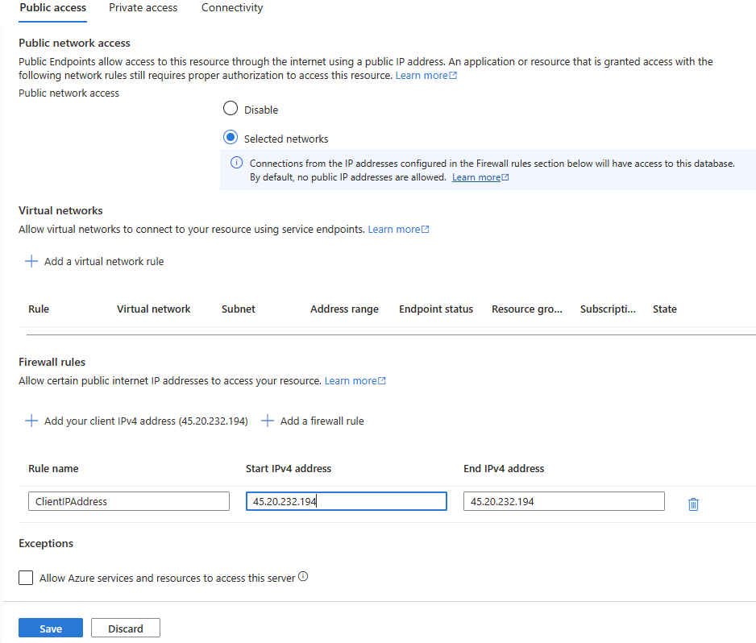

---
lab:
  title: Konfigurieren der Georeplikation für Azure SQL-Datenbank
---

# Konfigurieren der Georeplikation für Azure SQL-Datenbank

In dieser Übung erfahren Sie, wie Sie Georeplikation für eine Azure SQL-Datenbank aktivieren und ein Failover auf eine sekundäre Region durchführen. Dazu gehört das Erstellen eines Replikats Ihrer Datenbank, das Einrichten eines neuen Servers für die sekundäre Datenbank und das Initiieren eines erzwungenen Failovers. Außerdem erfahren Sie, wie Sie den Status Ihrer Bereitstellungen überprüfen und die Rolle von Geosekundären oder Georeplikaten in der Azure SQL-Datenbank-Verwaltung verstehen. Schließlich führen Sie manuell einen Failover der Datenbank auf eine andere Region mithilfe des Azure-Portals durch. Diese Übung bietet praktische Erfahrungen mit wichtigen Aspekten der Verwaltung und Sicherstellung der Resilienz Ihrer Azure SQL-Datenbank.

Diese Übung dauert ca. **30** Minuten.

> **Hinweis**: Um diese Übung abzuschließen, benötigen Sie Zugriff auf ein Azure-Abonnement, um Azure-Ressourcen zu erstellen. Wenn Sie kein Azure-Abonnement besitzen, können Sie ein [kostenloses Konto](https://azure.microsoft.com/free/?azure-portal=true) erstellen, bevor Sie beginnen.

## Vorbereitung

Um diese Übung abzuschließen, verwenden wir viele Ressourcen und Tools. Schauen wir uns jede einzelne davon genauer an:

|  | Beschreibung |
| --- | --- |
| **Primärer Server** | Ein Azure SQL-Datenbank Server, den wir in dieser Übung einrichten.|
| **Primäre Datenbank** | Die **AdventureWorksLT**-Beispieldatenbank wurde auf dem sekundären Server erstellt.|
| **Sekundärer Server** | Ein zusätzlicher Azure SQL-Datenbank Server, den wir in dieser Übung einrichten werden. |
| **Sekundäre Datenbank** | Dies ist unser Datenbankreplikat auf dem sekundären Server. |
| **SQL Server Management Studio** | Laden Sie das neueste [SQL Server Management Studio](https://learn.microsoft.com/sql/ssms/download-sql-server-management-studio-ssms) herunter und installieren Sie es auf einem Computer Ihrer Wahl. |

## Bereitstellen von Azure SQL-Datenbankressourcen

Erstellen wir die Azure SQL-Datenbankressourcen in zwei Schritten. Zunächst richten wir den primären Server und die primäre Datenbank ein. Anschließend wiederholen wir den Vorgang, um den sekundären Server mit einem anderen Namen einzurichten. Dies führt zu zwei Azure SQL-Servern mit jeweils eigenen Firewallregeln. Allerdings verfügt nur der primäre Server über eine Datenbank.

1. Navigieren Sie zum [Azure-Portal](https://portal.azure.com) und melden Sie sich mit Ihren Azure-Konto-Anmeldeinformationen an.

1. Wählen Sie die **Cloud Shell**-Option in der oberen rechten Menüleiste aus (sie sieht wie eine Shell-Eingabeaufforderung **`>_`** aus).

1. Ein Bereich wird von unten nach oben geschoben, in dem Sie aufgefordert werden, Ihren bevorzugten Shelltyp auszuwählen. Wählen Sie **Bash** aus.

1. Wenn Sie **Cloud Shell** zum ersten Mal öffnen, werden Sie aufgefordert, ein Speicherkonto zu erstellen (damit Ihre Daten über mehrere Sitzungen hinweg erhalten bleiben). Folgen Sie den Anweisungen, um ein Speicherkonto zu erstellen.

1. Nachdem die Shell gestartet wurde, steht Ihnen direkt im Azure-Portal eine Befehlszeilenschnittstelle zur Verfügung, in die Sie Ihre Skriptbefehle eingeben können.

1. Wählen Sie **{}**, um den Editor zu öffnen, kopieren Sie das nachstehende Skript und fügen Sie es ein. 
 
    > **Hinweis**: Denken Sie daran, die Platzhalterwerte im Skript durch Ihre tatsächlichen Werte zu ersetzen, bevor Sie sie ausführen. Wenn Sie das Skript bearbeiten müssen, geben Sie `code` in der **Cloud Shell** ein, um den integrierten Texteditor zu verwenden.
        
    ```powershell
    subscription="<Your subscription>"
    resourceGroup="<Your resource group>"
    location="<Your region, same as your resource group>"
    serverName="<Your SQL server name>"
    adminLogin="sqladmin"
    password="<password>"
    databaseName="AdventureWorksLT"
    
    az account set --subscription $subscription
    az sql server create --name $serverName --resource-group $resourceGroup --location $location --admin-user $adminLogin --admin-password $password
    az sql db create --resource-group $resourceGroup --server $serverName --name $databaseName --sample-name AdventureWorksLT --service-objective Basic

    ```
    Dieses Azure CLI-Skript legt das aktive Azure-Abonnement fest, erstellt einen neuen Azure SQL-Server und erstellt dann eine neue Azure SQL-Datenbank, die mit den AdventureWorksLT-Beispieldaten gefüllt wird.

1. Klicken Sie mit der rechten Maustaste auf die Editorseite, und wählen Sie **Speichern**.

1. Geben Sie einen Namen für die Datei an. Die Dateierweiterung sollte **.ps1** lauten.

1. Geben Sie im Cloud Shell-Terminal den Befehl ein und führen Sie ihn aus.

    ```bash
    chmod +x <script_name>.ps1

    ```
    
    Ersetzen Sie *<script_name>* durch den Namen, den Sie für das Skript angegeben haben. Dieser Befehl ändert die Berechtigungen der Datei, die Sie erstellt haben, um sie ausführbar zu machen.

1. Führen Sie das Skript aus. 
    
    ```powershell
    ./<script_name>.ps1

    ```

1. Navigieren Sie nach Abschluss des Vorgangs zum neu erstellten Azure SQL-Server, indem Sie zum Azure-Portal wechseln und zur Seite für Ihren SQL Server navigieren. 

1. Wählen Sie auf der Hauptseite Ihres Azure SQL Servers auf der linken Seite **Netzwerk**.

1. Wählen Sie auf der Registerkarte **Öffentlicher Zugriff** **Ausgewählte Netzwerke** aus.

1. Wählen Sie im Abschnitt **Firewallregeln** die Option **+ Client-IPv4-Adresse hinzufügen**. Geben Sie Ihre IP-Adresse ein und wählen Sie **Speichern** aus.

    

    Zu diesem Zeitpunkt sollten Sie über ein Clienttool wie SQL Management Studio eine Verbindung mit der primären `AdventureWorksLT`-Datenbank herstellen können.

1. Als Nächstes erstellen wir einen sekundären Azure SQL-Server. Wiederholen Sie die vorherigen Schritte (6–14), aber achten Sie darauf, dass Sie einen anderen `serverName` und `location` verwenden. Überspringen Sie außerdem den Code, der die Datenbank erstellt, indem Sie den `az sql db create`-Befehl auskommentieren. Dies führt zu einem neuen Server in einer anderen Region ohne die Beispieldatenbank.

## Aktivieren der Georeplikation

Als Nächstes erstellen wir das sekundäre Replikat für unsere Azure SQL-Ressourcen.

1. Navigieren Sie im Azure-Portal zu Ihrer Datenbank, indem Sie nach **SQL-Datenbanken** suchen.

1. Wählen Sie die SQL-Datenbank **AdventureWorksLT** aus.

1. Wählen Sie auf der Hauptseite Ihrer Azure SQL-Datenbank unter **Datenverwaltung** auf der linken Seite **Replikate** aus.

1. Wählen Sie **+ Replikat erstellen**.

1. Wählen Sie auf der Seite **SQL-Datenbank erstellen – Georeplikat** unter **Server** den zuvor erstellten neuen sekundären SQL Server aus.

1. Wählen Sie **Überprüfen + erstellen** und dann **Erstellen** aus. Die sekundäre Datenbank wird nun erstellt und mit einem Seed versehen. Um den Status zu überprüfen, sehen Sie unter dem Benachrichtigungssymbol oben im Azure-Portal nach. 

1. Im Erfolgsfall wechselt es von **Bereitstellung in Bearbeitung** zu **Bereitstellung erfolgreich**.

1. Stellen Sie mit SQL Management Studio eine Verbindung zu Ihrem sekundären Azure SQL-Server her.

## Ausführen eines Failovers einer SQL-Datenbank auf eine sekundäre Region

Stellen Sie sich ein Szenario vor, in dem die primäre Azure SQL-Datenbank aufgrund eines regionalen Ausfalls Probleme hat. Um die Kontinuität Ihrer Dienste sicherzustellen und Ausfallzeiten zu minimieren, müssen Sie ein erzwungenes Failover ausführen.

Ein erzwungenes Failover wechselt die Rollen Ihrer primären und sekundären Datenbanken. Die sekundäre Datenbank übernimmt als primäre Datenbank, und die ursprüngliche primäre Datenbank wird zur sekundären Datenbank. Auf diese Weise können Ihre Anwendungen weiterhin das sekundäre Replikat verwenden, während die Probleme mit der ursprünglichen primären Datenbank behoben werden.

Erfahren Sie, wie Sie ein erzwungenes Failover als Reaktion auf einen Regionsausfall initiieren.

1. Navigieren Sie zur SQL Server-Seite, und wählen Sie den sekundären Server aus.

1. Wählen Sie im Abschnitt **Einstellungen** auf der linken Seite **SQL-Datenbanken**.

1. Wählen Sie auf der Hauptseite Ihrer Azure SQL-Datenbank unter **Datenverwaltung** auf der linken Seite **Replikate** aus. Die Verknüpfung zur Georeplikation wird jetzt hergestellt.

1. Wählen Sie das Menü  **...** für den sekundären Server, und wählen Sie **Erzwungenes Failover**.

    > **Hinweis**: Das erzwungene Failover wechselt die Rolle der sekundären Datenbank in die primär. Alle Sitzungen werden während dieses Vorgangs getrennt.

1. Wenn Sie von der Warnmeldung dazu aufgefordert werden, wählen Sie **Ja**.

1. Der Status des primären Replikats wechselt zu **Ausstehend** und der des sekundären zu **Failover**. 

    > **Hinweis**: Dieser Vorgang kann einige Minuten in Anspruch nehmen. Sobald dies abgeschlossen ist, werden die Rollen umgekehrt: Der sekundäre Server wird zum neuen primären Server, und der ursprüngliche primäre Server wird in den sekundären Server umgewandelt.

Überlegen Sie sich, warum Sie Ihre primären und sekundären SQL-Server in derselben Region platzieren möchten und wann es vorteilhaft sein könnte, verschiedene Regionen auszuwählen.

Sie haben nun gesehen, wie Sie Georeplikate für die Azure SQL-Datenbank aktivieren und über das Portal ein manuelles Failover in eine andere Region durchführen.

## Bereinigen

Wenn Sie in Ihrem eigenen Abonnement arbeiten, sollten Sie sich am Ende eines Projekts überlegen, ob Sie die erstellten Ressourcen noch benötigen. 

Wenn Ressourcen unnötig ausgeführt werden, kann dies zu zusätzlichen Kosten führen. Sie können Ressourcen einzeln oder die gesamte Gruppe von Ressourcen im [Azure-Portal](https://portal.azure.com?azure-portal=true) löschen.

## Weitere Informationen

Weitere Informationen zur Georeplikation für die Azure SQL-Datenbank finden Sie unter [Aktive Georeplikation](https://review.learn.microsoft.com/azure/azure-sql/database/active-geo-replication-overview).